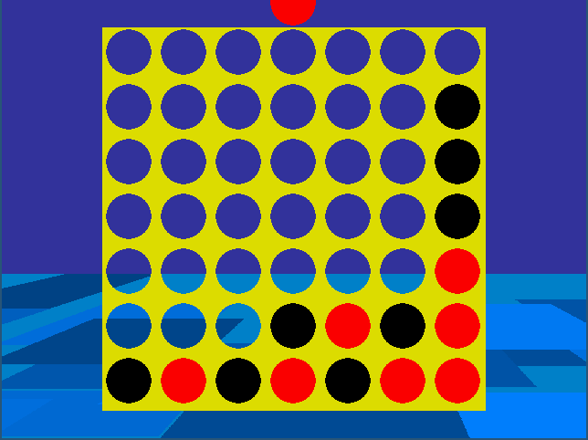

Grav-Twist Connect 4
======

The classic game of Connect 4, but with a twist: every few moves, the board rotates by 90 degrees, and the pieces fall into new positions.

Inspired by a GameToilet comic.

#Requirements
- Python 2
- Pygame

#How to Play
`$ python2 main.py`
Use the mouse (or arrow keys + enter) to drop pieces.
The space bar resets the board.
